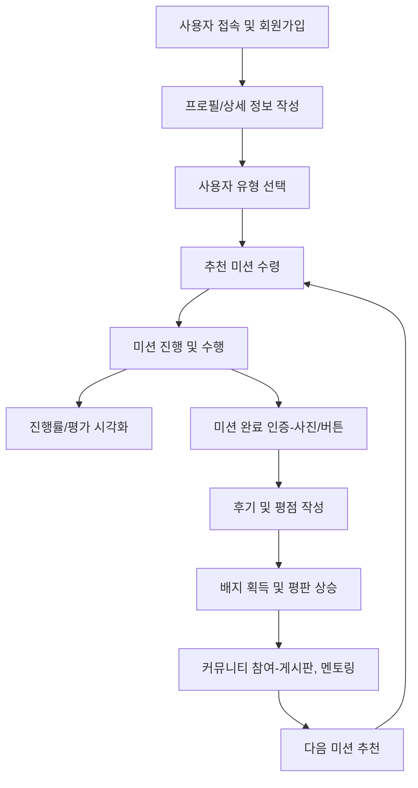
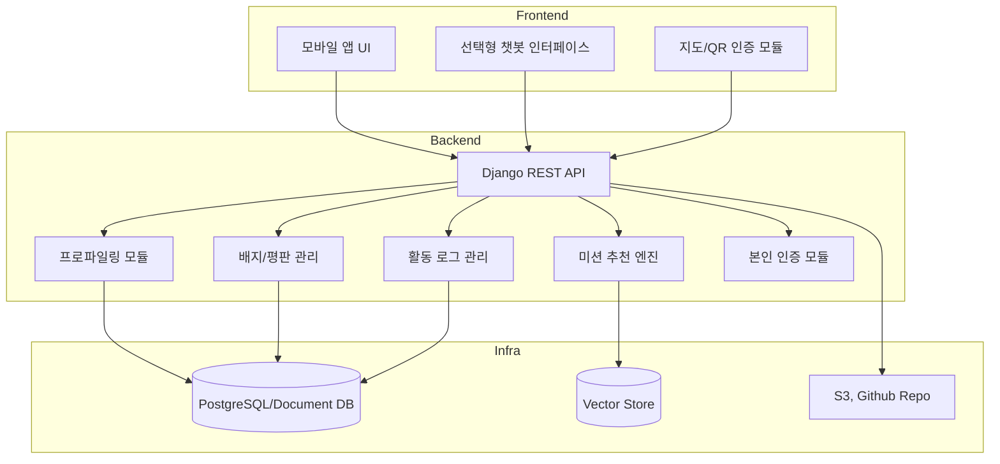
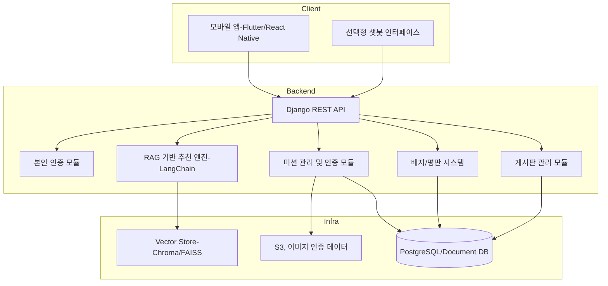
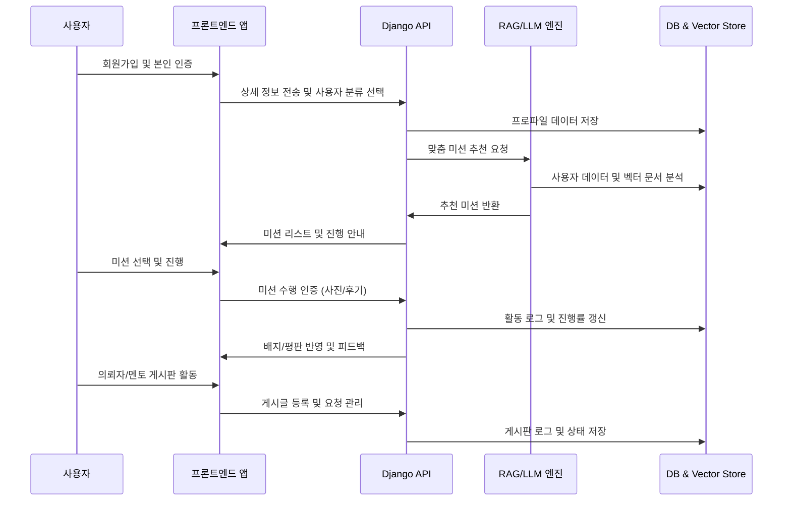

# 0. 서 - 사용자 분류
1. App 사용자(가입자)는 3가지로 분류 가능. 따라서 가입시 사용자 분류를 선택하고 그에 맞는 상세 데이터를 입력하도록 설계

- 귀향자: 고향, 귀향 시점, 경력, 기술, 관심사, 성향, 본인의 기대, **경력 지속/전환 선택** -> 초기 적응 점수 산정
- 의뢰자: 재능기부형 게시판의 의뢰자(지역주민). 게시글 작성시 업무분야 등 선택
- 멘토: 사회유대형 게시판의 멘토. 전문분야, 경력, 학력(?) 등 기재

2. 미션의 유형은 지역탐색형, 사회유대형, 재능기부형 3가지로 구성
3. 장년층을 주고객으로 판단한 만큼 제공되는 화면은 간단하고 직관적인 그래프를 이용한 시각화에 초점을 두어 진행

# 1. 회원가입
기본정보(`API`) 기입. 안전상의 이유로 본인인증 정도까진 필요해보임

# 2. 개인 상세 데이터 기입
기초 정보(신상정보 등)를 바탕으로 한 회원가입 후,
1) 사용자 분류에 대한 선택
2) 그에 따른 상세 정보 입력 - `선택형 Chatbot`
3) 귀향자에 대한 경력 지속/전환 선택 사항은 필수 기재사항
4) 개인 데이터 `LLM` 및 `RAG` 기반으로 분석
    - 개인별 성향 및 경력에 맞는 초기 정착 경로 설계

# 3. 서비스 제공 내용
이하 (1)-(7)번으로 접속할 수 있도록 MAIN 화면에 구현.<br>
(1)번 외에 나머지는 배치 순서, 구조 큰 상관없음<br>
(1)-(7)은 모두 병렬적인 구조임<br>

## (1) MAIN 화면 상단 - Profile 제공

### Inbody 화면 착안 - 그래프를 적극활용한 시각화
- 귀향자: 각 세션별 미션 진행률, 획득 배지, 내 평점/ 온도 등
    - ex) xx배지까지 의뢰수 n개! -> AI 이용한 목표제시
    - 미션의 분야를 세분화해서 5~6각형 모양의 미션 성취도 제시 
    - 미션 진행률에 관한 Tier 제시 가능
    - > Beginner, Intermediate,Advanced, Expert 등
- 의뢰자: 과거 의뢰내역, 새의뢰하기 등 '의뢰자 게시판'으로 바로 가도록 구성
- 멘토: 나의 멘티들의 프로필, 진행상황 등 보이도록 설계
    - ex) 마찬가지로, 멘티의 적응도, 진행률에 따른 Tier 제시 가능
    - > Specialist, Veteran, Maste, Legend 등

## (2) 금일의 추천 미션
### 3가지의 유형 section을 나눠서 각 유형별 미션2~3가지 제시
- `RAG, llm` 기반하여 프로필에서 제시되는 미션성취도가 5각형에 가까워지도록 추천 OR 가입자의 성향에 맞게 추천
- 새로운 미션, 학습 콘텐츠 추천
- 사회적 관계 강화, 기술 공유, 지역 정착 강화

## (3) 나의 진행 중 미션
- 3 section으로 구획을 나누어 진행 중인 미션을 표현
- 지역 적응 점수와 활동 지표 업데이트
- 수행 결과 자동 기록


## (4) 완료된 미션
- 완료 미션 list 제공 - 미션을 선택시 의뢰자 등의 후기 확인 가능토록
- 미션 진행에 대한 진행률 제공 - 그래프 시각화
- 사회유대형 or 재능기부형 미션 완료시, 좋아요 or 평점 등 기재
- 활동 로그 및 성과 DB 저장
- 적응 점수 상승 -> 다음 단계 미션 추천 강화


## (5) 의뢰자 게시판
- 글쓰기 기능: 두가지로 나누어 운영 1) 의뢰자의 의뢰하기 2) 귀향자의 의뢰찾기
- 사용자간 contact시 방법 구상 요구
    - > 안심번호제공, 채팅연결 등 개인정보보호 및 치안에 관한 이슈 해소 필요
    - > 기술 인증 완료 후 지역 활동(소상공인 돕기 등)에 참여
- 실질적 소득 및 지역 활성화 기여
- 작성글을 `AI(llm)`가 판단하여 미션의 3 section 중 어디인지 자동지정
    - ex) 의뢰내용: 바둑두실분! -> 사회유대형
    - ex) 의뢰내용: 화장실 수전 교체 해주세요! -> 재능기부형

## (6) 멘토링 게시판
- 상기 의뢰자 게시판과 구조와 진행방식은 비슷
- 1) 멘토를 구하는 게시판 2) 멘티를 구하는 게시판
- 기재내용에 대한 사전에 전부된 양식 제공 필요.
    - 경력, 전공 등 자기소개서 양식처럼 게시글 작성자의 편의성 제공(`llm`)
- 사용자간 연결시 이슈 해소 필요

## (7) 획득배지 목록
- 활동 완료 시 배지 부여
- 전체 배지의 종류를 볼 수 있도록
- 미획득 배지는 무채색, 획득 배지는 유채색 구현
- 획득한 배지를 최상단에 몰아볼 수 있도록 구현
- 기술 인증 배지 등으로 신뢰도 및 지역 내 영향력 상승

# 4. 각 미션 상세

## (1) 지역탐색
추억장소 가보기, 마을 행사 참여, 동사무소 방문 ->`지도 API`, `RAG`
## (2) 사회유대
지역 소모임(ex바둑), 이웃 만나기, 지역 커뮤니티 모임 참석,마을 축제 의뢰자들과 함께 가보기 -> `RAG`
## (3) 재능기부
의뢰자 게시판 호출. 경력지속형 의뢰자는 교육, 멘토링, 실무진행 등
## (4) 완료여부 확인 방법
- 지역탐색형, 사회유대형: 인증샷 `AI 멀티모달 판독후 승인`
- 재능기부형: 의뢰자의 승인버튼 -> 완료미션으로 이전 및 후기작성

# 5. 마치며
- 정부 부처에서 운영하는 서비스의 성격을 짙게 나타낸다면, 의뢰자 및 멘토의 가입을 행정기관이 담당하도록하고, 본 서비스는 귀향자만의 정보만을 취급할 가능성 기대
- 하지만 가능성 불투명


---

# 6. 사용자 여정

## (1) 사용자 여정 맵

| 단계            | 사용자 행동        | 사용자                    | 서비스 제공 기능|
| ------------- | --------------------- | ------------------------ | ----------------------- |
| 회원가입/프로파일링    | 정보 입력 (경력, 기술, 관심사 등) | 나에게 맞는 추천과 준비            | 입력 폼, 초기 적응 점수 계산       |
| 분석 및 초기 추천    | 분석 결과 확인              | 나에게 맞는 맞춤 미션 탐색          | LLM + RAG 기반 분석, 시각적 요약 |
| 미션 수행         | 탐색, 유대 활동, 기부 미션 수행   | 지역 적응, 사회적 연결, 자기 효능감 회복 | 실시간 미션 가이드, QR/지도 연동    |
| 결과 및 피드백      | 기록 확인, 점수/배지 확인       | 성취감, 신뢰도 상승              | 활동 로그, 배지 발급, 피드백 제공    |
| 기술 인증 및 지역 참여 | 지역 기술 활동 참여           | 지역 사회 기여, 소득 기회          | 기술 인증, 평판 시스템, 매칭 서비스   |
| 반복/확장 단계      | 새 미션 탐색 및 참여          | 지속적 성장과 관계 강화            | 개인화된 미션 순환 추천           |

> 목표: 개인화된 정착, 사회적 연결, 기술/경력 재활용 -> 성취감과 지역 기여 달성

## (2) 사용자 여정 시나리오 (예시)

### 1) 초기 가입 단계

1. 사용자 → 웹/앱 접속 → 기본 정보 및 귀향 희망 지역 입력
2. 시스템 → RAG 기반 분석 → 적응 점수 계산
3. 맞춤 미션 제안 → 사용자에게 시각적으로 표시


### 2) 미션 수행 단계

1. "고향 학교 방문" 미션 선택 → QR 체크인, 후기 작성
2. 시스템 → 자동 로그 기록 → 점수/배지 즉시 갱신


### 3) 기술 인증 및 지역 기여 단계

1. 기술 인증 신청 → 예: 영상 편집 기술
2. 관리자 검토 → 인증 승인 → 지역 소상공인과 매칭
3. 지역 활동 완료 → 소득 창출 + 평판 상승 + 추가 미션 추천


### 4) 결

* **서비스 흐름도**: 사용자 경험 중심의 단계별 자연스러운 순환
* **확장성**: 다양한 지역, 다양한 연령대 및 활동으로 확장 가능
---

# 7. 시스템 전체 구성

### 🔹 프론트엔드

* **플랫폼**: Web (React, Vue), 모바일 (React Native, Flutter)
* **기능**

  * 회원가입 및 프로파일링 입력 UI
  * 개인 맞춤형 미션 표시 및 진행
  * 실시간 챗봇 인터페이스 (LangChain + GPT)
  * 지도 및 QR 기반 지역 미션 연동
  * 배지 및 평판 현황 표시
  * 활동 로그 시각화 대시보드


### 🔹 백엔드

* **프레임워크**: Django (Python)
* **주요 모듈**

  * 사용자 관리 & 인증 (회원가입, 로그인, 권한)
  * 프로파일링 엔진 (경력, 기술, 관심사, 귀향 지역 분석)
  * 미션 추천 모듈 (RAG 기반 맞춤 추천)
  * 미션 관리 및 진행 상태 추적
  * 활동 로그 관리 (미션 기록, 수행 내역)
  * 배지 및 평판 관리 모듈
  * 기술 인증 및 지역 기여 매칭 모듈
  * REST API 제공


### 🔹 AI 및 RAG 엔진

* **LLM 모델**: GPT (OpenAI API), LangChain 사용
* **RAG 구성**

  * 문서/정책 데이터: 벡터화하여 Vector Store에 저장 (Chroma 또는 FAISS)
  * 질의 시 사용자 프로파일과 결합한 문서 검색 → 개인화된 시나리오 생성


### 🔹 인프라

* **DB**: PostgreSQL (관계형 DB), 또는 MongoDB (비정형 데이터)
* **Vector DB**: Chroma / FAISS
* **스토리지**: AWS S3 (활동 기록, 이미지, 지도 데이터 등)
* **배포**: AWS EC2, Lambda (API 확장용), AWS CloudFront (정적 리소스)


### 🔹 보안 및 모니터링

* OAuth, JWT 기반 사용자 인증
* CloudWatch, Sentry 등으로 모니터링
* 데이터 암호화 및 접근 통제


### 🔹 주요 API 설계 (예시)

| Method | Endpoint               | 설명                |
| ------ | ---------------------- | ----------------- |
| POST   | /api/signup            | 회원가입 및 초기 프로파일 생성 |
| POST   | /api/profile/update    | 프로파일 추가/수정        |
| GET    | /api/missions          | 개인 맞춤 미션 리스트 조회   |
| POST   | /api/missions/complete | 미션 완료 기록          |
| GET    | /api/badges            | 배지 및 평판 현황 조회     |
| POST   | /api/match/confirm     | 기술 인증 및 지역 활동 확정  |


---

# 8. 모듈별 상세 API 문서 (OpenAPI 스펙 형태 요약) (예시)

## ⚡️ 기본 정보

```yaml
openapi: 3.0.0
info:
  title: 고향으로ON API
  version: 1.0.0
  description: 장년층 귀향 및 정착 코디네이터 플랫폼 API
servers:
  - url: https://api.gohyangon.com/v1
```


## 🟢 Authentication

```yaml
components:
  securitySchemes:
    BearerAuth:
      type: http
      scheme: bearer
      bearerFormat: JWT
security:
  - BearerAuth: []
```


## 🟠 주요 엔드포인트

### 1️⃣ 회원가입 / 프로파일링

```yaml
paths:
  /signup:
    post:
      summary: 회원가입 및 초기 프로파일 생성
      requestBody:
        required: true
        content:
          application/json:
            schema:
              $ref: '#/components/schemas/UserProfile'
      responses:
        '201':
          description: 사용자 등록 완료
```


### 2️⃣ 프로필 업데이트

```yaml
paths:
  /profile/update:
    post:
      summary: 사용자 프로필 정보 수정
      requestBody:
        required: true
        content:
          application/json:
            schema:
              $ref: '#/components/schemas/UserProfile'
      responses:
        '200':
          description: 업데이트 성공
```


### 3️⃣ 맞춤 미션 추천

```yaml
paths:
  /missions:
    get:
      summary: 개인 맞춤형 미션 리스트 조회
      responses:
        '200':
          description: 미션 리스트 반환
```


### 4️⃣ 미션 완료 처리

```yaml
paths:
  /missions/complete:
    post:
      summary: 미션 완료 기록
      requestBody:
        required: true
        content:
          application/json:
            schema:
              $ref: '#/components/schemas/MissionComplete'
      responses:
        '200':
          description: 완료 기록 성공
```


### 5️⃣ 배지 및 평판 조회

```yaml
paths:
  /badges:
    get:
      summary: 사용자 배지 및 평판 정보 조회
      responses:
        '200':
          description: 정보 반환
```


### 6️⃣ 기술 인증 신청 및 상태 확인

```yaml
paths:
  /match/confirm:
    post:
      summary: 기술 인증 및 활동 매칭 확정
      requestBody:
        required: true
        content:
          application/json:
            schema:
              $ref: '#/components/schemas/SkillConfirm'
      responses:
        '200':
          description: 매칭 성공
```


## 🔵 스키마 예시

```yaml
components:
  schemas:
    UserProfile:
      type: object
      properties:
        name:
          type: string
        birth_year:
          type: integer
        region:
          type: string
        skills:
          type: array
          items:
            type: string
        interests:
          type: array
          items:
            type: string
        adapt_score:
          type: number
    MissionComplete:
      type: object
      properties:
        mission_id:
          type: string
        feedback:
          type: string
        completed_at:
          type: string
          format: date-time
    SkillConfirm:
      type: object
      properties:
        skill_id:
          type: string
        notes:
          type: string
```

---

# 9. DB ERD 설계 문서(예시)

## 🟠 핵심 테이블

### 1️⃣ users

| 컬럼           | 타입       | 설명        |
| ------------ | -------- | --------- |
| id           | PK       | 사용자 고유 ID |
| name         | string   | 이름        |
| birth\_year  | int      | 출생 연도     |
| region       | string   | 귀향 지역     |
| adapt\_score | float    | 적응 점수     |
| created\_at  | datetime | 가입일       |


### 2️⃣ user\_skills

| 컬럼       | 타입     | 설명     |
| -------- | ------ | ------ |
| id       | PK     | 고유 ID  |
| user\_id | FK     | 사용자 ID |
| skill    | string | 기술 이름  |


### 3️⃣ missions

| 컬럼          | 타입     | 설명                 |
| ----------- | ------ | ------------------ |
| id          | PK     | 미션 고유 ID           |
| title       | string | 미션 제목              |
| type        | string | 미션 유형 (탐색, 유대, 기부) |
| description | text   | 상세 설명              |


### 4️⃣ user\_missions

| 컬럼            | 타입       | 설명          |
| ------------- | -------- | ----------- |
| id            | PK       | 고유 ID       |
| user\_id      | FK       | 사용자 ID      |
| mission\_id   | FK       | 미션 ID       |
| status        | string   | 상태 (완료/진행중) |
| feedback      | text     | 수행 후기       |
| completed\_at | datetime | 완료 일시       |


### 5️⃣ badges

| 컬럼         | 타입       | 설명     |
| ---------- | -------- | ------ |
| id         | PK       | 배지 ID  |
| user\_id   | FK       | 사용자 ID |
| title      | string   | 배지 이름  |
| issued\_at | datetime | 발급 일시  |


### 6️⃣ skill\_certifications

| 컬럼           | 타입       | 설명            |
| ------------ | -------- | ------------- |
| id           | PK       | 인증 ID         |
| user\_id     | FK       | 사용자 ID        |
| skill        | string   | 기술 이름         |
| status       | string   | 상태 (승인/대기/거절) |
| verified\_at | datetime | 인증 일시         |


## 🟢 ERD 간 관계

* **users** ↔ **user\_skills**: 1\:N
* **users** ↔ **user\_missions**: 1\:N
* **missions** ↔ **user\_missions**: 1\:N
* **users** ↔ **badges**: 1\:N
* **users** ↔ **skill\_certifications**: 1\:N


## ✅ 요약

* **OpenAPI 스펙**: 각 기능별 엔드포인트와 JSON 스키마 설계 완료
* **ERD 설계**: 사용자, 기술, 미션, 배지, 인증 흐름과 관계 명확화


---

# 10. DB 마이그레이션 SQL 초안(예시)

```sql
-- users 테이블
CREATE TABLE users (
    id SERIAL PRIMARY KEY,
    name VARCHAR(100) NOT NULL,
    birth_year INT NOT NULL,
    region VARCHAR(100) NOT NULL,
    adapt_score FLOAT DEFAULT 0.0,
    created_at TIMESTAMP NOT NULL
);

-- user_skills 테이블
CREATE TABLE user_skills (
    id SERIAL PRIMARY KEY,
    user_id INT NOT NULL REFERENCES users(id),
    skill VARCHAR(100) NOT NULL
);

-- missions 테이블
CREATE TABLE missions (
    id SERIAL PRIMARY KEY,
    title VARCHAR(255) NOT NULL,
    type VARCHAR(50) NOT NULL,
    description TEXT
);

-- user_missions 테이블
CREATE TABLE user_missions (
    id SERIAL PRIMARY KEY,
    user_id INT NOT NULL REFERENCES users(id),
    mission_id INT NOT NULL REFERENCES missions(id),
    status VARCHAR(50) NOT NULL,
    feedback TEXT,
    completed_at TIMESTAMP
);

-- badges 테이블
CREATE TABLE badges (
    id SERIAL PRIMARY KEY,
    user_id INT NOT NULL REFERENCES users(id),
    title VARCHAR(100) NOT NULL,
    issued_at TIMESTAMP NOT NULL
);

-- skill_certifications 테이블
CREATE TABLE skill_certifications (
    id SERIAL PRIMARY KEY,
    user_id INT NOT NULL REFERENCES users(id),
    skill VARCHAR(100) NOT NULL,
    status VARCHAR(50) NOT NULL,
    verified_at TIMESTAMP
);
```


## ✅ 요약

* **ERD 시각화**: 주요 테이블 관계 한눈에 확인 가능
* **DB SQL 초안**: PostgreSQL 기준, 실제 배포 시 컬럼 타입, 인덱스, 제약 조건 추가 가능


---

# 11. 시각화 자료 코드

## (1) 서비스 플로우(귀향자ver.)



## (2) 시스템 아키텍처
### 1) ver.1



### 2) ver.2



## (3) 서비스 시나리오 흐름도


