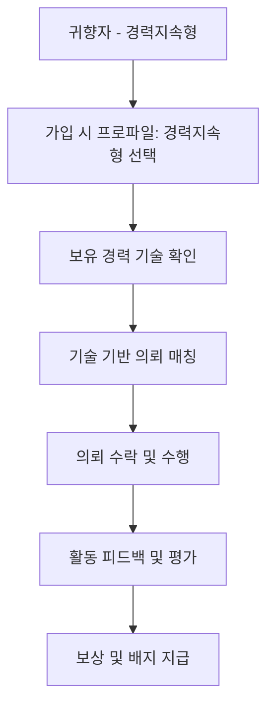
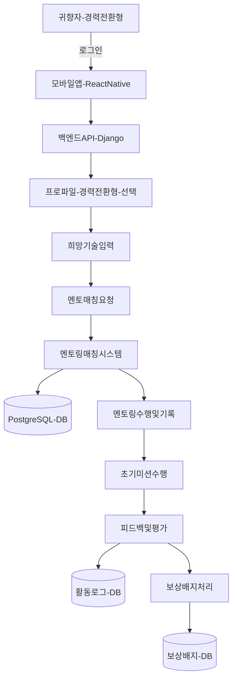
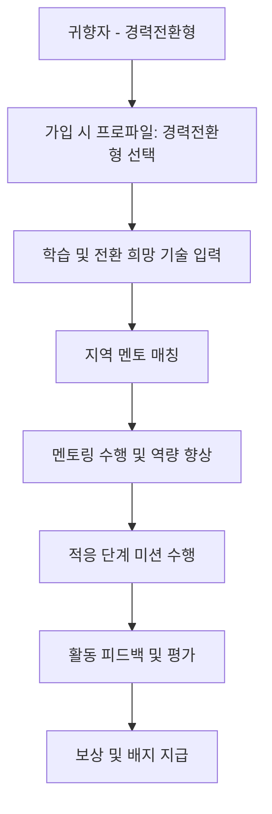
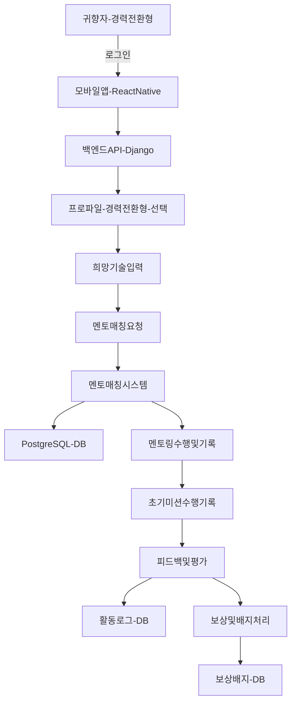
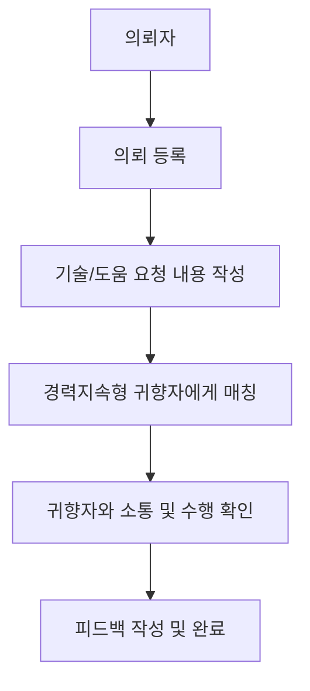
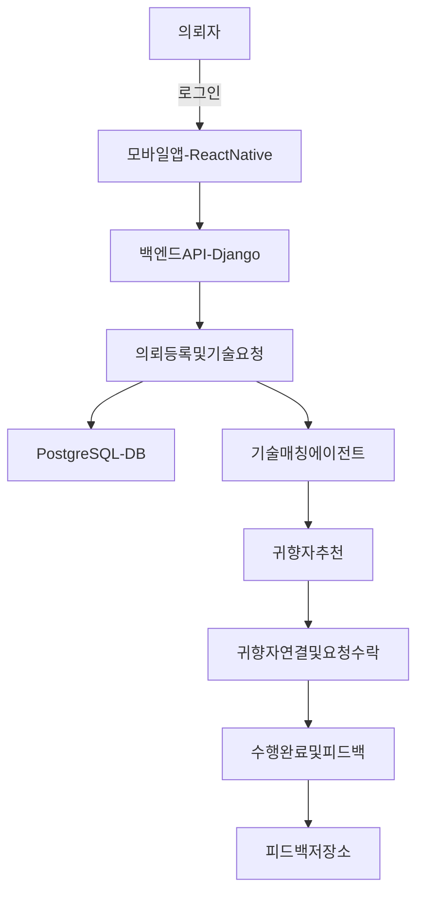
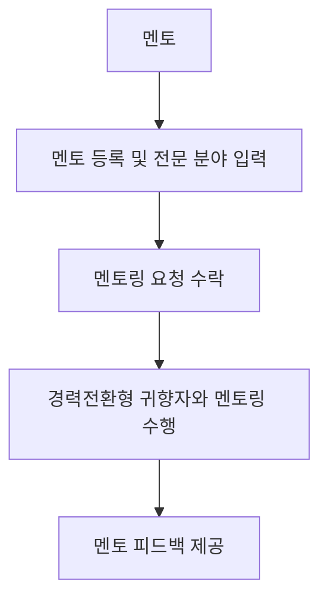
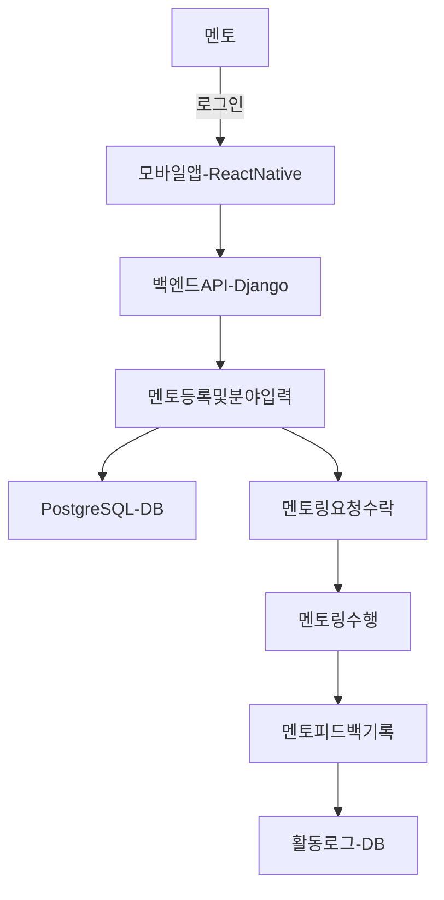
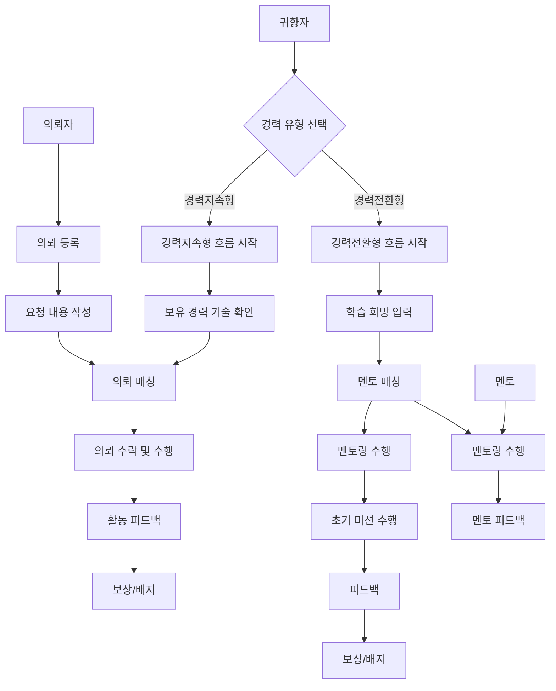
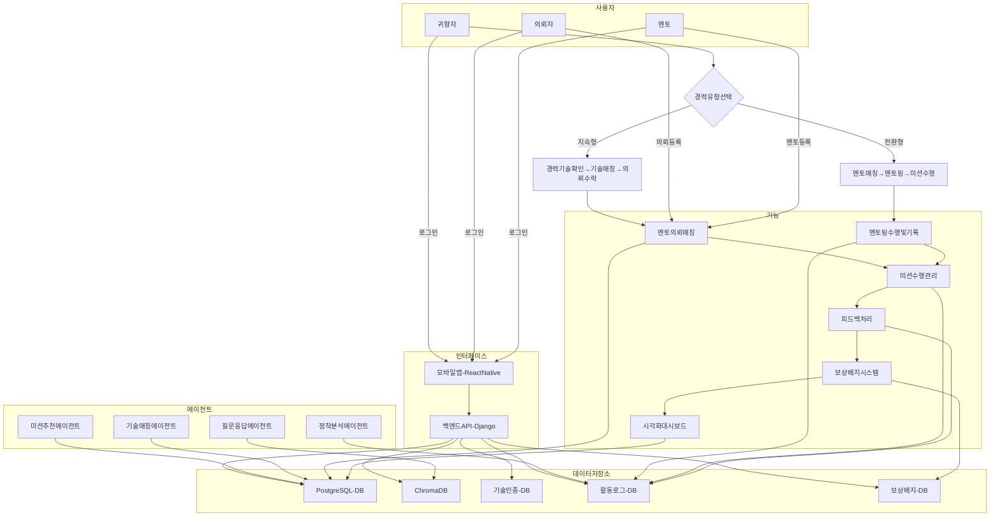

## 1. 추진 배경

(1) **구조적 인구 변화와 지방 소멸 위기**

1970년대 이후 대한민국은 **산업화·도시화**로 인해 대규모 농촌 인구가 도시로 이동하는
**이촌향도(離村向都)** 현상을 겪었습니다.

* 1970\~1990년 사이, 수도권·대도시로의 **연간 순전입 인구는 최대 50만 명**
* 1990년대 중반 이후부터는 지방 전출이 전입을 초과하는 **역전 현상** 지속
* 현재 대한민국 전체 **시·군·구의 절반 이상이 ‘소멸 위험 지역’**으로 분류

이러한 흐름은 단순한 인구 감소를 넘어, **지역의 경제·사회 기능 약화**로 이어지며
지방 공동체의 **지속 가능성 자체를 위협**하고 있습니다.

---

(2) **청년층 대상 디지털 정책의 한계**

지방 소멸 위기를 막기 위해 정부와 지자체는 **청년층 유입 정책 및 디지털 기반 서비스**에 집중해 왔습니다.
대표적으로는 웹·앱 기반 정착 플랫폼, 청년 일자리 매칭 시스템, 정착 장려금 등이 있습니다.

그러나 현실은 다음과 같습니다.

* 지방의 **주거·문화·교통 인프라 미비**
* **커리어 성장 기회 부족 및 고립감 심화**
* **또래 네트워크 단절로 인한 정서적 고립**

이로 인해 청년층은 지방에 잠시 머무르더라도 **대도시로 다시 이동**하는 경우가 많고,
**청년 중심 디지털 접근 방식만으로는 지속 가능한 정착 생태계 구축에 한계**가 있다는 점이 확인되고 있습니다.

---

(3) **장년층 중심 정착 모델의 필요성**

이러한 구조적 문제 속에서 특히 주목해야 할 인구집단은
**1970\~80년대 상경했던 당시 청년층**, 즉 **현재 50\~64세의 퇴직 장년층**입니다.

이들은 다음과 같은 강점을 지니고 있습니다.

* 고향에 대한 **정서적 유대감**
* 축적된 **전문 기술 및 사회적 경험**
* 은퇴 이후의 **사회 참여 욕구와 자기 효능감 회복 욕구**

하지만 귀향 이후에는

* **지역 내 사회적 관계 부재**,
* **디지털 기술 소외**,
* **새로운 커리어 탐색의 어려움** 등으로 인해 정착이 쉽지 않습니다.

이들을 위한 **정책적·디지털 기반 정착 설계가 필요**하며,
이는 지역사회 재활성화의 **현실적인 대안**이 될 수 있습니다.

---

(4) **프로젝트의 필요성과 방향성**

본 프로젝트는 **퇴직 장년층을 중심으로 한 정착 지원 플랫폼**을 제안합니다.
생성형 AI를 활용해 장년층의 경험과 감정, 기술을 분석하고,
이를 기반으로 **개인 맞춤형 미션을 제시**함으로써 다음을 실현합니다:

* **정서적 적응 → 사회적 연결 → 기술 기여**의 정착 3단계 모델
* **자기 효능감 회복 및 지역 공동체 기여 구조** 구축
* **지방 소멸 대응 및 초고령 사회 문제 해결에 기여**

---

## 2. 개발 목표 및 내용

(1) **서비스 구현 목표**

본 프로젝트는 **생성형 AI 기반의 미션형 정착 코디네이터 플랫폼 ‘고향으로 ON’**을 통해,
퇴직 장년층이 지방에 **정착하고**, **사회적 관계를 회복하며**, **기술과 경험을 지역사회에 기여**할 수 있도록 지원합니다.

이 플랫폼은 장년층의 귀향 이후 겪는

* **정서적 소외**,

* **사회적 단절**,

* **기술 소외 및 무력감**
  같은 문제를 해소하기 위해 다음과 같은 목표를 지향합니다:

* **지역 탐색 → 관계 형성 → 재능 기여**의 단계적 정착 모델 구현

* **AI 기반 맞춤형 미션 수행 시스템**을 통해 자기 효능감 회복

* **사회적 평판과 기술 인증 체계**를 통해 지역 내 역할 정립

* 궁극적으로 **지방 공동체의 재활성화와 순환형 지역 생태계 구축**

---

(2) **주요 기능 및 시스템 구성**

① **사용자 등록 및 프로파일링**

* 사용자의 지역, 귀향 시점, 경력, 기술, 관심사 등 입력 정보 수집
* 이를 기반으로 사용자 DB를 구축하고 **초기 적응 지표**를 산정

② **LLM 기반 맞춤형 미션 추천 시스템**

* 입력 정보와 지역 데이터를 기반으로
  **생성형 AI(LLM)**가 개인 맞춤형 미션을 생성
* 미션 유형은

  * **지역 탐색형**: 공간·정보 적응
  * **유대 형성형**: 이웃 및 커뮤니티 연결
  * **재능 기부형**: 전문성 기반 사회 환원

③ **미션 수행 이력 및 적응 수치 갱신 시스템**

* 수행 내역은 **활동 로그로 자동 저장**
* 이를 바탕으로 **적응 수치 갱신**,
  정착 정도에 따라 **다음 미션 자동 조정**

④ **기술 순환형 재능 매칭 시스템**

* 사용자 기술 DB ↔ 지역 도움 요청 DB 간
  **LLM 기반 기술 매칭 알고리즘 구현**
* 흐름 구조:
  `기술 학습 → 인증 → 재능 기부 → 보상 → 지역 내 평판 형성`

⑤ **보상 및 평판 시스템**

* 활동 이력, 기술 인증, 미션 성공률 등을 종합하여
  **시각적 배지, 등급, 신뢰도 지표 제공**
* 지역사회에서 **신뢰 기반의 역할 강화 및 동기 부여** 기능 수행

---

(3) **비즈니스 모델 및 자본 구조**

① **B2G 모델 (공공 위탁 기반)**

* 지자체, 교육청, 복지기관 등의 **정착 지원 정책 사업과 연계**
* 지방소멸 대응 기금, 고령자 사회참여 예산 등으로 운영비 위탁
* 예:

  * 충북도청과 '장년 귀향 미션 지원 사업' 위탁
  * 교육청과 진로 멘토링 연계
* 지자체는 AI 기반 운영, 효과 분석 기능을 플랫폼에 위탁 가능

② **B2B 모델 (지역 민간 수요 기반)**

* 지역 소상공인·마을기업의 **디지털 기술 수요**에
  퇴직자 전문 인력을 **기술 매칭**
* 예: SNS 운영, 홍보 영상 제작, 브랜딩 컨설팅 등
* 수익 구조:

  * 기술 매칭 수수료
  * 고급 기능 구독형 서비스
  * 인증/교육 유료화 서비스 등

③ **지속 가능성 확보 전략**

* **단기**: 공공 예산 기반 시범사업
* **중기**: 정량적 성과 기반 위탁계약 체결
* **장기**:

  * 사회적 경제 펀드
  * ESG 민간 투자
  * 커뮤니티 화폐·포인트 연계 등
    **복합 자본 구조 설계**

---

✅ 주요 기능 및 서비스
| 분류                 | 기능명         | 설명                                                                    |
| ------------------ | ----------- | --------------------------------------------------------------------- |
| **1. 사용자 맞춤 추천**   | 미션 추천 시스템   | 사용자의 프로파일(귀향 동기, 기술, 관심사 등)을 기반으로 지역 탐색형 / 사회 유대형 / 재능 기부형 미션을 AI가 추천 |
|                    | 기술 매칭 시스템   | 사용자의 보유 기술과 지역 내 수요를 분석하여 적합한 기여 활동 제안 (예: 농기계 수리, SNS 마케팅, 교육 등)     |
| **2. 정착 지원 활동**    | 미션 수행 관리    | 추천받은 미션을 수행하고, 진행 상황을 기록하고 평가할 수 있는 UI 제공                             |
|                    | 활동 로그 및 피드백 | 사용자 활동 이력 저장, 활동 후 피드백 시스템으로 평판 및 개선 유도                               |
| **3. 사회적 연결**      | 의뢰자·멘토 게시판  | 지역 주민이나 멘토가 요청 글을 올리고, 귀향자가 응답해 협업할 수 있는 커뮤니티 기능                      |
|                    | 멘토링 매칭      | 지역 선배나 전문가와 귀향자를 연결해 정착 노하우 공유 가능                                     |
| **4. 동기부여 및 보상**   | 배지 및 평판 시스템 | 미션 달성에 따라 배지 수여, 활동 이력 기반 평판 시스템 운영                                   |
|                    | 보상 시스템      | 기여 활동에 대한 포인트 지급 및 지역 상점 연계 보상 검토 가능                                  |
| **5. 기술 인증 및 시각화** | 기술 인증 관리    | 외부 자격증 또는 지역 기여 기반 기술 인증 시스템                                          |
|                    | 대시보드 시각화    | 정착 현황, 미션 수행률, 기술 기여 정도 등을 사용자 개인화 시각화로 제공                            |

1. 귀향자 (경력지속형)

ver1

ver2

2. 귀향자 (경력전환형)
ver1

ver2

3. 의뢰자

ver1

ver2

4. 멘토

ver1

ver2

5. 전체

ver1

ver2

