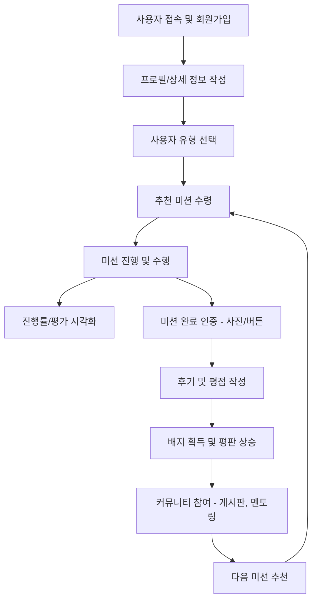
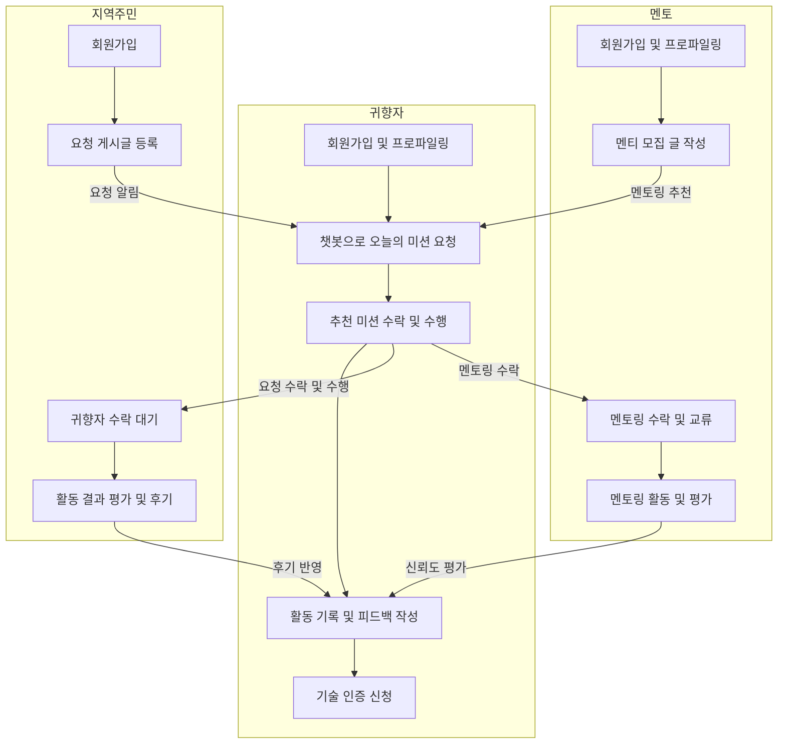

# 1. 추진배경

1. 사업 배경 및 문제 인식
1970년대 이후 대한민국은 산업화와 도시화로 인해 대규모 농촌 인구가 도시로 이동하는 이촌향도(離村向都) 현상이 본격화되었습니다. 통계청 『인구이동통계연보』에 따르면, 1970~1990년 사이 수도권 및 대도시로의 연간 순전입 인구가 최대 약 50만 명에 달할 정도로 인구 집중이 심각했습니다. 그러나 1990년대 중반 이후부터는 지방에서 도시로의 전출이 전입을 넘어서는 역전 현상이 심화되며, 현재 전체 시·군·구의 절반 이상이 ‘소멸 위험 지역’으로 분류되는 지방 소멸 위기에 직면해 있습니다.

2. 귀촌 가구의 증가
통계청 데이터(2024년 기준)에 따르면 귀농가구는 8,243가구로 전년 대비 20.0% 감소한 반면,
귀촌가구는 318,658가구로 전년 대비 4.0% 증가했습니다.
귀농은 감소하지만 귀촌은 여전히 증가 추세를 보이며 지방에서 도시적 생활방식을 유지하는 형태를 선호는 경향이 확인됩니다.

3. 핵심 인구 집단 및 사회적 필요
이러한 구조적 문제 속에서 특히 주목해야 할 인구집단은 1970~80년대 상경했던 당시 청년층, 즉 현재 50~64세의 퇴직 장년층입니다. 이들은 고향에 대한 정서적 유대는 남아있으나, 퇴직 이후 새로운 일자리나 커리어를 찾기 어려워 귀향과 정착이 쉽지 않습니다. 하지만 이들은 지역사회와 다시 연결될 수 있는 핵심 세대이자, 은퇴 이후에도 사회적 관계와 전문성을 발휘하고자 하는 잠재적 욕구가 높은 집단입니다.
나아가, 장년층은 청년층에 비해 이미 축적된 재산이 있으며, 더 많은 경험에 기반해 소규모 창업 등이 가능합니다.
청년층보다 소득창출능력은 낮지만 자산기반 안정성은 확보된 인구집단으로서, 이들의 귀향으로 지방 경제의 활성화를 도모할 수 있습니다.

4. 장년층의 귀향을 위한 도움의 필요성
고향이 있다고해서 고향으로 이사가기가 쉽지 않다. 고향을 떠나 은퇴할 때까지 시간적 간극이 클 것이며, 다양한 현실적인 문제를 직면할 수 밖에 없다.
안정적인 귀향을 통해 지역사회에 정착하기 위해서는 다음과 같은 문제를 해결해야한다.
- 1) 시간의 간극에 따른 이질감: 분명 어린시절 추억이 담긴 고향이지만, 이미 낯설어진 공간이 되어버려 새로운 적응이 필요하다.
- 2) 지역사회에 대한 문화적 적응: 지역 커뮤니티에 자연스럽게 섞이기 위한 교두보가 필요하다.
- 3) 장기적인 정착을 위한 일자리: 장년층은 은퇴하였다하뎌라도 여전히 경제활동능력이 있기에 꾸준한 경제활동을 위한 일자리가 필요하다.

5. 사업 개요: ‘고향으로 ON’ 플랫폼
본 팀은  K-Digital Training에서 습득한 생성형 AI 등 첨단 디지털 신기술 역량을 바탕으로, 장년층의 귀향·정착·지역 기여를 연결하는 디지털 플랫폼 ‘고향으로 ON’을 제안합니다. 이 플랫폼은 공공기관(지자체)이 운영 주체가 되어, 지역 내 다양한 이해관계자가 상호 협력하는 구조로 설계되었습니다.
'고향으로 ON'은 단순한 귀향 지원을 넘어, 장년층의 삶의 2막을 지역사회와 연결하는 디지털 기반 인력 순환 모델로서, 지역 소멸 해소와 초고령 사회 대응이라는 두 가지 사회적 과제에 실질적 해결방안을 제시하고자 합니다.

6. 문제해결을 위한 주요 서비스
본 프로젝트는 RAG기반 생성형 AI를 활용해 참여자의 경력, 기술, 감정 데이터를 분석하고, 이를 바탕으로 상기 귀향을 위한 도움의 필요성을 해결합니다.
- 1) 정서적 미션: '고향 학교 다시 가보기'등 지역에 대한 친숙감을 높이는 미션 제공
- 2) 사회적 연결: 이웃과의 만남, 마을 행사 참여 등 사회적 관계 형성 지원
- 3) 기술기반 활동: 재교육, 멘토링, 지역사회기여 활동 등 실질적 참여 유도

# 2. 개발 목표 및 내용

1. 서비스 구현 목표
정년 퇴직 후 지방에 정착한 장년층의 사회적 고립, 변화된 지역의 어색함, 기술 소외 문제를 해결하기 위해 AI 기반의 미션형 정착 코디네이터 서비스를 개발합니다. 지역 탐색, 사회적 유대 향상, 커리어 활동을 미션화하여 정착자의 지역 적응과 사회 연결, 경력 활용을 촉진하며, 사회적 소외를 방지하고 자기 효능감을 높임으로써 지역 공동체의 활성화를 이끕니다.

2. 개발 목표
본 프로젝트의 개발 목표는 기간내에 '개인 정보와 활동 데이터를 종합해 RAG 기반 LLM이 균형 잡힌 맞춤형 미션을 추천하는 기능'과 '자연어 처리 기반 챗봇이 핵심 인터페이스로 작동하는 대화 중심 앱 서비스' 두 가지 핵심 내용을 검증 가능한 최소 기능 제품(Minimum Viable Product)으로 구현하는 것입니다.

3. 데이터 소스 + 처리과정
- 데이터 소스 : 1) 공공데이터 포털 - 파일 데이터 & 오픈 API(CSV/JSON 형식의 데이터) 2) 각 행정관청(ex. 군청)의 웹사이트 크롤링
- 처리과정 : 데이터의 일관성을 확보하기 위해 불필요한 컬럼을 제거하고 형식을 통일하는 전처리 과정을 수행합니다. 이후, 장소/활동 등 구분에 따라 정보를 분리하여 RAG 모델이 검색할 수 있는 벡터 DB(Vector Database)를 구축합니다.

4. 주요 기능 및 서비스

| 분류                 | 기능명         | 설명                                                                    |
| ------------------ | ----------- | --------------------------------------------------------------------- |
| **1. 사용자 맞춤 추천**   | 미션 추천 시스템   | 사용자의 프로파일(귀향 동기, 기술, 관심사 등)을 기반으로 지역 탐색형 / 사회 유대형 / 커리어 활동형 미션을 AI가 추천 |
|                    | 기술 매칭 시스템   | 사용자의 보유 기술과 지역 내 수요를 분석하여 적합한 기여 활동 제안 (예: 농기계 수리, SNS 마케팅, 교육 등)     |
| **2. 정착 지원 활동**    | 미션 수행 관리    | 추천받은 미션을 수행하고, 진행 상황을 기록하고 평가할 수 있는 UI 제공                             |
|                    | 활동 로그 및 피드백 | 사용자 활동 이력 저장, 활동 후 피드백 시스템으로 평판 및 개선 유도                               |
| **3. 사회적 연결**      | 의뢰인·멘토 게시판  | 지역 주민이나 멘토가 요청 글을 올리고, 귀향자가 응답해 협업할 수 있는 커뮤니티 기능                      |
|                    | 멘토링 매칭      | 지역 선배나 전문가와 귀향자를 연결해 정착 노하우 공유 가능                                     |
| **4. 동기부여 및 보상**   | 배지 및 평판 시스템 | 미션 달성에 따라 배지 수여, 활동 이력 기반 평판 시스템 운영                                   |
|                    | 보상 시스템      | 기여 활동에 대한 포인트 지급 및 지역 상점 연계 보상 검토 가능                                  |
| **5. 기술 인증 및 시각화** | 기술 인증 관리    | 외부 자격증 또는 지역 기여 기반 기술 인증 시스템                                          |
|                    | 대시보드 시각화    | 정착 현황, 미션 수행률, 기술 기여 정도 등을 사용자 개인화 시각화로 제공                            |

5. 주요 개발 내용
1) Chatbot 기반 서비스 제공
장년층의 사용 편의성을 위해, Chatbot을 기반으로 서비스가 제공됩니다. 챗봇은 본 서비스 기능구현의 중심이 되며, text를 적는 것이 불편한 장년층을 위해 마이크 버튼을 눌러 음성인식을 통한 자연어 질의도 가능합니다(speech to text). 자연어 질의가 입력되면 llm이 의도분석을 통해 질문을 분석하고 이해하여 적정한 기능을 구현하는 Agent의 기능을 실행합니다. (ex. '그동안 완료한 미션 보여줘' > llm 의도분석 > 완료미션 데이터 조회 agent 실행 > 완료미션 데이터 출력)
2) 귀향자 가입시 경력전환형/경력유지형 둘로 나누어 프로파일링
본 프로젝트는 귀향자를 두 가지 유형으로 나누어 서비스를 제공합니다. 첫번째는 경력을 전환하여 새로운 커리어에 도전하는 유형입니다. 창농을 원하는 귀향자가 대표적인 예시입니다. 이들에게는 지역 멘토를 연결해주어 멘토링을 통해 지역사회에 자연스럽네 녹아들 수 있도록 서비스를 진행합니다. 두번째는 기존의 경력을 유지하며 커리어 활동을 이어가는 유형입니다. 이 유형은 바로 현장에 투입되어 지역경제 활동에 기여합니다. 특히, 경력유지형은 서비스 가입시 자신의 면허증을 인증하는 경우 인증배지를 부여하고 귀향자의 프로필에 인증배지를 나타나게하여 귀향자의 신뢰도를 향상시키도록 합니다.
3) MAIN 화면(목업 사진 첨부 예정)
서비스에 로그인하면 MAIn 화면 상단에 서비스 가입자의 프로필이 나타납니다. 가입자를 위한 '금일의 추천미션', '배지 현황, 오각형 그래프로 표현한 '활동 현황'이 화면에 구현됩니다. 하단에는 서비스의 중심이 되는 '챗봇'버튼이 있으며 그외 의뢰/멘토링 게시판과 같은 각종서비스에 손쉽게 연결될 수 있습니다.
4) 사용자 맞춤형 미션 추천 - 금일의 추천 미션
"가입시 저장된 정보 + 완료된 미션의 유형(지역탐색형/사회유대형/커리어활동형)간의 균형 + 활동 현황(활동성/사회성/적응력/도전성/연대감)의 균형"을 조합적으로 고려하여 RAG 기반의 llm 미션 추천 서비스를 제공합니다. 사용자가 특정 미션이나 활동 성격에 치우치지 않도록 다방면의 미션을 AI가 추천해줍니다. 세가지 지역탐색형/사회유대형/커리어활동형 유형에 대해 각각 두가지 정도의 미션을 추천합니다.
나아가 미션 거절기능을 통해 사용자가 원하지 않는 미션을 거를 수 있고, 걸러진 미션의 내용을 참고하여 AI가 비슷한 유형의 미션은 추천하지 않도록 합니다.
5) 매칭서비스 - 게시판 기능
게시판은 두가지 게시판으로 나뉩니다. 첫번째는 지역주민이 간단한 일거리를 의뢰하는 의뢰게시판입니다. 의뢰인(지역주민)은 의뢰게시판에 의뢰내용을 입력하고, 입력된 의뢰를 AI가 살펴보고 의뢰내용과 관련있는 귀향자(기술제공자)에게 그 내용을 알립니다(AI가 살펴보는 것이 아닌, 키워드 중심의 알림서비스로 다운그레이드 가능). 알림을 받은 귀향자는 게시판을 통해 의뢰인에게 접근할 수 있고, 의뢰를 수락하고 이후 의뢰를 완료하면 의뢰인의 의료완료 버튼 클릭을 통해 완료된 의뢰내용이 저장됩니다. 저장된 완료의뢰는 귀향자의 입장에서는 '사회유대형' 미션에 대한 '완료된 미션'에 해당하고 완료된 미션으로서 저장됩니다. 두번째는 멘토를 구하기 위한 멘토링게시판입니다. 멘토는 멘티를 구하기 위한 게시글을 올리고, 귀향자는 멘티로서 멘토에게 접근합니다. 멘토는 여러명의 멘티를 멘토-멘티 관계를 맺을 수 있으며, 멘티에게 노하우 등을 전수하며 귀향자는 이에 대해 평점을 매길 수 있습니다. 이러한 평점은 멘토의 신뢰성을 나타내는 표지로서 작용합니다.
6) 리워드 기능
본 서비스는 귀향자에게 다양한 미션을 수행한 결과 특정 조건을 만족한다면 배지를 수여합니다(ex. 사회유대형 미션 100회 완료 돌파 배지). 각종 타이틀을 가진 배지가 부여된다면, 귀향자의 업무능력에 대한 신뢰도를 보여주는 역할을 합니다. 

6. 서비스 흐름도 (귀향자ver.)

