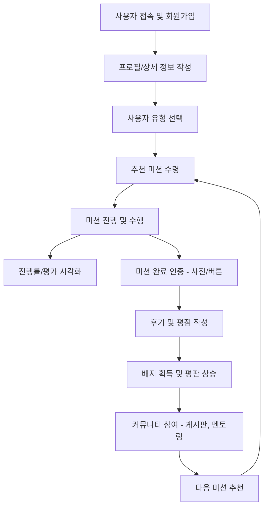
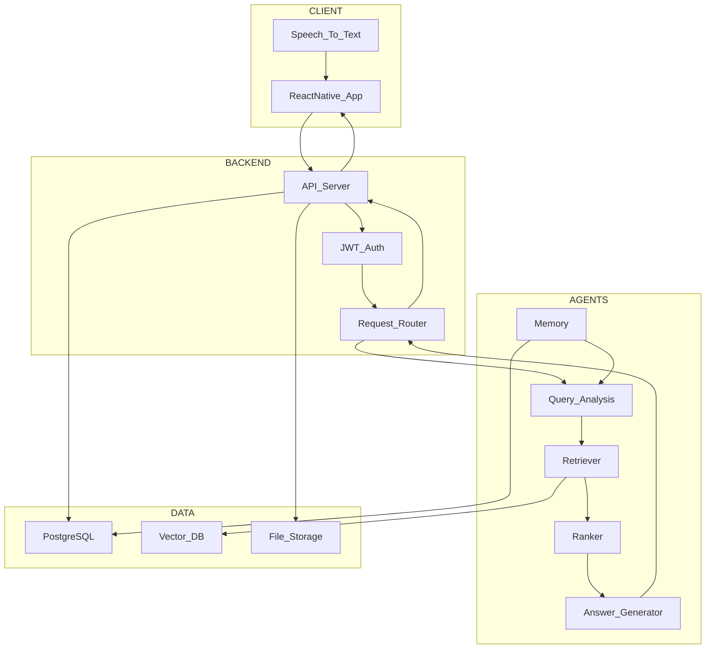
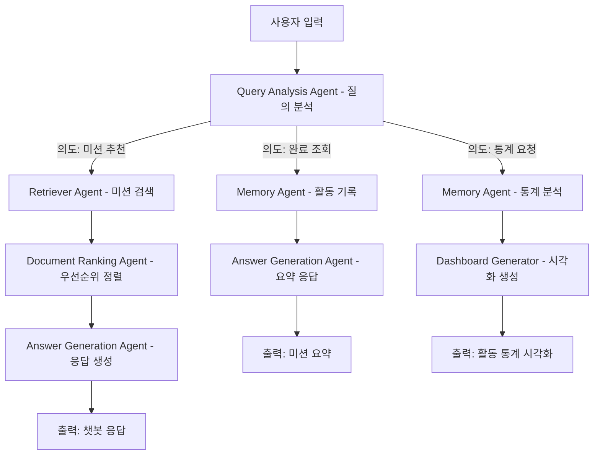

# 「고향으로 ON」 해커톤 기획안

# 1. 추진 배경

### 1. 지방 인구의 지속적 감소와 사회 구조적 위기

대한민국은 지난 수십 년간 급격한 산업화와 도시화를 경험하면서, 농촌 지역에서 대도시로의 인구 유출이 가속화되는 ‘이촌향도(離村向都)’ 현상을 겪어왔습니다. 통계청의 『인구이동통계연보』에 따르면, 1970년부터 1990년까지 수도권으로 유입된 연간 순전입 인구는 최대 50만 명에 달하는 등, 농촌 기반의 인구 구조가 급속히 붕괴되었습니다. 이러한 현상은 도시 집중 현상으로 이어졌고, 그 반작용으로 지방의 인구 감소와 고령화는 더욱 심화되었습니다.

1990년대 중반 이후부터는 지방에서 대도시로의 전출이 전입을 초과하는 ‘역전 이주 현상’이 본격화되었으며, 현재 전국 시·군·구의 절반 이상이 ‘소멸 위험 지역’으로 분류되고 있습니다. 이는 단순한 인구 통계의 문제가 아닌, 국가 차원의 균형 발전과 공동체 회복을 위한 구조적 위기로 인식되어야 합니다.

### 2. 귀농은 감소, 귀촌은 증가… 새로운 삶의 방식의 등장

통계청이 발표한 2024년 기준 자료에 따르면, 귀농 가구는 8,243가구로 전년 대비 20% 감소한 반면, 귀촌 가구는 318,658가구로 전년 대비 4% 증가한 것으로 나타났습니다. 이는 전통적 농업 기반의 정착보다는, **도시적 삶의 방식을 유지한 채 지방에 정착하고자 하는 새로운 인구 흐름**이 나타나고 있음을 보여줍니다. 즉, 지방으로의 이주는 더 이상 ‘농업 귀의’만을 의미하지 않으며, 다양한 경력과 삶의 방식이 공존하는 복합적 정착 형태로 전환되고 있습니다.

### 3. 핵심 귀향 대상: 퇴직 장년층의 귀환과 가능성

귀향 인구 중에서도 특히 주목해야 할 집단은 1970~~80년대 상경하여 도시에서 커리어를 쌓은 뒤 퇴직을 맞이한 50~64세의 장년층입니다. 이들은 고향에 대한 정서적 유대를 갖고 있으나, 오랜 시간 도시생활에 익숙해진 탓에 귀향 및 재정착에 대해 심리적·물리적 장벽을 갖고 있습니다. 하지만 이들은 이미 일정 수준의 재산을 축적한 안정된 세대이며, 다양한 산업 분야의 경험과 전문성을 보유하고 있습니다. 특히, 소규모 창업, 멘토링, 기술 기여 등 **지역사회에 지속 가능한 방식으로 기여할 수 있는 잠재력 높은 세대**입니다.

### 4. 장년층의 귀향 정착을 가로막는 주요 장벽

현실적으로 고향이 있다고 해서 누구나 쉽게 귀향하여 정착할 수 있는 것은 아닙니다. 귀향을 고려하는 장년층이 겪는 공통된 장벽은 다음과 같습니다.

* **정서적 단절**: 과거의 고향은 더 이상 익숙한 공간이 아닙니다. 장기간 떨어져 지낸 탓에 공간에 대한 낯섦과 이질감을 느끼게 됩니다.
* **문화적 단절**: 지역 공동체에 적응하고 새로운 관계를 형성하는 데 어려움이 있으며, 기존 커뮤니티의 암묵적 규범과 관계망에 진입하기 위한 적절한 통로가 부족합니다.
* **경제적 단절**: 은퇴 후에도 경제활동을 이어가고자 하는 수요는 존재하나, 이를 연결해줄 기회와 플랫폼은 거의 부재합니다.

### 5. 해결방안으로서의 ‘고향으로 ON’ 플랫폼 제안

이러한 상황을 종합적으로 고려한 결과, 본 프로젝트는 생성형 AI 기술을 기반으로 장년층의 귀향과 지역 정착을 지원하는 **디지털 기반 정착 코디네이터 플랫폼**, 『고향으로 ON』을 제안합니다.

‘고향으로 ON’은 귀향자의 정서적 연결, 사회적 소속, 기술적 역량 활용이라는 세 가지 축을 중심으로 설계되며, 지역 내 다양한 이해관계자(귀향자-주민-멘토) 간의 상호작용을 가능케 하는 통합 플랫폼입니다. 이는 단순 귀향 지원을 넘어 **지역 순환 인력 모델**로 기능하며, 초고령 사회와 지역 소멸이라는 국가적 과제에 대한 하나의 실질적 대안을 제시합니다.

---

# 2. 개발 목표 및 내용

## 2. 개발 목표 및 서비스 기획

### 2.1. 서비스 구현 목표

본 프로젝트는 퇴직 이후 지방에 정착하고자 하는 장년층을 대상으로, **디지털 기술을 통해 새로운 삶의 방식과 공동체 참여 모델을 설계**하는 것을 목표로 합니다. 구체적으로는 다음과 같은 사회적 문제 해결을 지향합니다.

* 지역 정착에 대한 불안감 해소
* 새로운 사회적 관계망 형성
* 경력 활용 기반의 경제활동 기회 제공
* 기술 활용 소외 방지 및 디지털 적응

이러한 목표를 달성하기 위해, 본 플랫폼은 **AI 기반 ‘미션형 정착 코디네이터’ 서비스**로서, 지역 탐색, 사회적 유대, 기술 기반 기여 등 각종 활동을 **개인 맞춤형 미션**으로 제안하고, 사용자의 활동 이력을 분석하여 정착 과정을 체계화합니다.

### 2.2. 핵심 개발 목표

1. RAG 기반 생성형 AI 기술을 활용하여 **귀향자의 경력·기술·활동 정보를 통합 분석**하고, 균형 잡힌 미션을 자동 추천하는 시스템 구현
2. 자연어 질의 응답 기반의 \*\*대화형 인터페이스(Chatbot)\*\*를 통해 사용자 경험을 향상시키는 모바일 서비스 구축
3. 위 기능들을 조합하여, **검증 가능한 최소 기능 제품(MVP, Minimum Viable Product)** 수준의 서비스 구현 및 검증

### 2.3. 데이터 수집 및 처리 과정

* **데이터 소스**:

  * 공공데이터포털에서 제공하는 지역 정보 API 및 CSV/JSON 파일
  * 각 지자체(군청 등) 홈페이지에서 크롤링한 지역행사 및 수요정보
* **데이터 처리**:

  * 전처리: 불필요 컬럼 제거, 데이터 형식 통일
  * 정보 분류: 장소 기반, 활동 기반 등으로 카테고리 분류
  * 벡터화: RAG 모델의 검색 효율을 위한 Vector Database 구축

---

## 3. 주요 기능 및 서비스 구조

### 3.1. 기능별 상세 설명

| 분류              | 기능명         | 세부 설명                                                     |
| --------------- | ----------- | --------------------------------------------------------- |
| **사용자 맞춤 추천**   | 미션 추천 시스템   | 귀향자의 동기, 경력, 기술, 관심사를 기반으로 적정 미션(지역탐색형 / 사회유대형 / 커리어형) 추천 |
|                 | 기술 매칭 시스템   | 사용자의 기술 역량과 지역사회 수요 간 매칭 (예: 마을 SNS 운영, 장비 수리, 원예 재능기부 등) |
| **정착 지원 활동**    | 미션 수행 관리    | 미션 수락, 실행, 기록, 완료 보고 등 UI 제공                              |
|                 | 활동 로그 및 피드백 | 활동 이력 저장 및 피드백 기록, 평판 시스템과 연동                             |
| **사회적 연결 기능**   | 의뢰/멘토 게시판   | 지역주민의 수요 글, 멘토의 제안글에 귀향자가 응답하여 커뮤니티 연결                    |
|                 | 멘토링 매칭      | 멘토-멘티 관계 형성, 평가 기반 신뢰도 시스템 운영                             |
| **보상 및 인증**     | 배지 및 평판 시스템 | 미션 달성 시 배지 수여, 활동 평판에 따른 등급화                              |
|                 | 리워드 시스템     | 포인트 적립 및 지역 자원과의 연계 보상                                    |
| **기술 인증 및 시각화** | 기술 인증       | 외부 자격 기반 또는 기여 기반 기술 인증 시스템                               |
|                 | 대시보드 시각화    | 활동 현황, 기여도, 성취율 등을 시각화한 개인화 UI 제공                         |

---

## 4. 핵심 설계 요소 및 서비스 흐름

본 장에서는 「고향으로 ON」 플랫폼의 전반적인 서비스 흐름을 구성하는 핵심 설계 원리와 각 요소 간의 기능적·논리적 연계 구조에 대해 상세히 설명드립니다. 해당 설계는 퇴직 장년층이 현실적으로 마주하게 되는 귀향의 장벽을 해소하고, 지속적인 활동 참여와 지역사회 기여를 가능하게 하기 위해 **‘AI 기반 정착 코디네이션’** 개념을 중심으로 구조화되었습니다.

### 4.1. 사용자 중심 챗봇 인터페이스 기반 설계

고령 사용자 비중이 높은 본 서비스의 주요 타깃 특성을 반영하여, 전체 시스템은 \*\*자연어 기반 챗봇 인터페이스(Chatbot First Design)\*\*를 중심으로 설계되었습니다. 본 챗봇은 단순한 기능 안내를 넘어서 다음과 같은 특성을 갖습니다.

* **음성 인식(Speech to Text) 지원**
  디지털 접근성이 낮은 고령층 사용자를 위해, 음성 입력 기능을 제공합니다. 사용자는 버튼 클릭 후 자연스럽게 말을 걸면 서비스를 이용할 수 있도록 설계되어 있습니다.

* **자연어 이해(NLU) 기반 질의 처리**
  사용자의 질문이나 요구가 텍스트 또는 음성으로 입력되면, 이를 대형 언어 모델(LLM)이 분석하여 적절한 의도(Intent)를 판단하고 해당 기능 모듈을 호출합니다.

* **예시 시나리오**
  사용자가 “오늘 할 일 뭐 있어요?”라고 말하면, 챗봇이 해당 질의를 분석하고 사용자의 프로필 및 최근 활동 내역을 반영하여 ‘금일의 추천 미션’을 출력합니다.

이러한 인터페이스 설계는 복잡한 메뉴 구조나 터치 기반 조작 없이도, 사용자가 자연어 기반 음성 대화를 통해 전체 기능에 접근할 수 있도록 하여 접근성과 지속 이용률을 동시에 제고하고자 하였습니다.

### 4.2. 귀향자 유형 기반 프로파일링 구조

사용자가 플랫폼에 최초로 가입할 때는, **귀향자 유형 구분 구조**에 따라 ‘경력 유지형’ 또는 ‘경력 전환형’ 중 하나를 선택하게 됩니다. 이 유형 분류는 이후의 미션 추천, 멘토링 연결, 기술 인증 등 주요 서비스 흐름에서 핵심적인 분기점 역할을 수행합니다.

* **경력 유지형 귀향자**
  기존에 보유한 자격이나 기술을 유지하며 지역사회에 곧바로 투입 가능한 유형입니다. 예를 들어, 운전면허, 전기기사, 간호조무사, 농기계 수리 자격 등을 보유한 귀향자들이 이에 해당됩니다.

  * 기술 인증 시 프로필에 ‘신뢰 배지’를 부여하고,
  * 의뢰 매칭 및 기술 기여형 미션 중심으로 추천 구조가 설계됩니다.

* **경력 전환형 귀향자**
  새로운 커리어(예: 창농, 공예, 마을 기업 등)를 준비 중인 유형으로,

  * 지역 멘토와 매칭하여 초기 적응을 유도하며,
  * 탐색형 미션 및 멘토링 기반 활동이 중심이 됩니다.

이와 같은 유형 구분은 서비스의 추천 정확도를 향상시킬 뿐만 아니라, 사용자가 자신의 귀향 목적을 명확히 인식하고, 플랫폼 내 정체성을 형성하는 데에도 기여합니다.

### 4.3. MAIN 화면(UI/UX) 설계 요소

‘고향으로 ON’ 플랫폼의 MAIN 화면은 사용자 경험의 시작점이자, 전체 서비스 기능의 허브 역할을 수행합니다. 특히 고령 사용자의 특성을 고려하여, **복잡하지 않으면서도 직관적으로 현재 상태를 파악하고 주요 기능에 접근할 수 있도록** 설계되었습니다.

<<<<<<<<<<<<<<<<<<<<<<<<MAIN 화면 이미지 목업 넣기>>>>>>>>>>>>>>>>>>>>>>>>

#### 1) 개인화된 상단 정보 표시 영역

메인화면 최상단에는 사용자의 주요 프로필 정보가 노출되며, 다음과 같은 요소가 시각적으로 집약되어 있습니다:

* 사용자 이름 및 유형 (경력유지형/경력전환형 구분)
* 현재까지 완료한 미션 수 및 배지 보유 현황
* 기술 인증 상태 (예: 인증 마크 형태의 배지)
* ‘금일의 추천 미션’ 3종 요약 카드 (탐색형, 유대형, 커리어형 각 1개씩)

이를 통해 사용자는 앱 접속과 동시에 자신의 현재 상태와 오늘의 우선 활동을 빠르게 인지할 수 있습니다.

#### 2) 활동 현황 시각화: 오각형 그래프 영역

중단부에는 사용자의 활동 성향을 시각화한 **5요소 오각형 레이더 차트**가 위치합니다. 각 축은 다음의 활동 지표를 기반으로 구성됩니다:

* 활동성(Activity)
* 사회성(Sociability)
* 적응력(Adaptability)
* 도전성(Challenging)
* 연대감(Solidarity)

이 시각화는 단순 수치 제공을 넘어, 사용자가 **스스로 어떤 영역에서 활동이 부족하거나 집중되었는지를 직관적으로 파악**하도록 돕는 기능을 수행합니다. 이는 추후 미션 추천의 설득력을 강화하는 기반이 됩니다.

#### 3) 챗봇 버튼 및 하단 네비게이션 구성

하단 중앙에는 본 서비스의 핵심 인터페이스인 **챗봇 실행 버튼**이 고정되어 있으며, 사용자는 이를 통해 모든 기능에 자연어로 접근할 수 있습니다. 챗봇 버튼은 직관적인 아이콘 및 마이크 버튼과 연계되어, 음성 인식 기반의 질의도 가능합니다.

이외에도 하단에는 주요 기능으로 연결되는 간단한 탭 또는 바로가기 버튼들이 위치합니다:

* \[의뢰 게시판] – 지역 주민의 요청 확인
* \[멘토링 게시판] – 지역 멘토 탐색
* \[활동 로그] – 나의 미션 수행 기록 보기
* \[배지 모아보기] – 수집한 배지 목록 확인

#### 4) 전체 설계 방향

MAIN 화면은 “보여주기”보다는 “이끌어주기”에 초점을 맞춘 \*\*행동 유도형 인터페이스(Behavioral UX)\*\*를 지향합니다. 이를 통해 사용자는 복잡한 조작 없이 오늘 해야 할 일, 내가 가진 역량, 현재 상태, 나의 성과를 자연스럽게 파악하고 행동으로 이어지게 됩니다.


### 4.4. 행동 분석 기반 미션 추천 알고리즘

본 서비스의 핵심 기능 중 하나는 **RAG 기반의 대형 언어 모델이 사용자에게 맞춤형 미션을 추천하는 시스템**입니다. 해당 시스템은 단순히 사용자의 관심사만을 반영하는 것이 아니라 다음과 같은 다중 요소를 복합적으로 분석하여, ‘금일의 추천 미션’을 자동으로 도출합니다.

* 가입 시 입력한 기본 정보 (귀향 동기, 기술, 관심 분야 등)
* 사용자가 완료한 미션 유형의 분포 (탐색형 / 사회유대형 / 커리어형)
* 활동 성향 평가 지표 (활동성, 사회성, 적응력, 도전성, 연대감 등)
* 사용자의 미션 거절 기록을 통한 선호 필터링

이러한 정보를 기반으로, 시스템은 하루에 3\~6개의 미션을 제안하며, **특정 영역에 과도하게 편중되지 않도록 균형을 맞추는 알고리즘**을 적용하고 있습니다. 또한 사용자가 제안된 미션을 거절할 경우, 해당 기록은 모델 학습에 반영되어 향후 더 정교한 맞춤형 추천이 이루어질 수 있도록 설계되어 있습니다.

### 4.5. 챗봇-미션-보상 간의 순환 구조

본 플랫폼은 사용자가 챗봇과의 상호작용을 통해 미션을 추천받고, 해당 미션을 수행하며, 그 결과를 기록함으로써 **미션 → 활동 → 보상 → 재추천**으로 이어지는 **자기 강화적 피드백 루프** 구조를 형성하고 있습니다.

구체적인 순서는 다음과 같습니다.

1. 사용자가 챗봇에게 질문하거나 “오늘 뭐하지?”와 같은 자연어 질의를 입력합니다.
2. 챗봇은 현재 사용자의 활동 상태 및 성향에 따라 적합한 금일 미션을 제안합니다.
3. 사용자는 제안된 미션을 수행하고, 사진 업로드 또는 버튼 클릭으로 완료를 인증합니다.
4. 완료된 미션은 자동으로 활동 로그에 저장되며, 후기 또는 평가를 작성할 수 있습니다.
5. 누적된 활동 데이터는 LLM에 의해 학습되며, 다음 미션 추천에 반영됩니다.

이러한 순환 구조는 기능 단위가 아니라 **서비스 전체의 흐름을 하나의 유기적 경험으로 연결**함으로써, 사용자 참여의 지속성과 만족도를 동시에 제고할 수 있도록 설계하였습니다.

### 4.6. 커뮤니티 연결 및 매칭 기능 흐름

사용자가 지역사회와 실질적인 관계를 형성하고, 기술 기반 활동을 수행할 수 있도록 두 가지의 커뮤니티 기능을 함께 운영합니다.

* **의뢰 게시판 기능**

  * 지역 주민이 간단한 일거리나 도움이 필요한 요청을 게시합니다.
  * 시스템은 해당 의뢰의 키워드를 분석하여 적절한 기술을 가진 귀향자에게 알림을 전달합니다.
  * 귀향자는 해당 의뢰를 수락하고 활동을 수행하며, 완료 시 ‘사회유대형 미션’으로 기록됩니다.

* **멘토링 게시판 기능**

  * 지역의 선배 멘토가 멘티를 모집하는 게시글을 등록합니다.
  * 귀향자는 멘티로 참여하여 멘토와의 지속적인 교류가 가능하며,
  * 멘토링 종료 후 평가 및 피드백 기능을 통해 신뢰 기반을 시각화할 수 있습니다.

이러한 기능은 단순한 정보 공유를 넘어서, **실제 협업과 관계 형성을 유도하는 인터페이스**로 구현되어 지역 커뮤니티의 유기적 통합을 지향합니다.

### 4.7. 배지 및 리워드 시스템 설계

사용자 활동에 대한 지속적인 동기 부여와 신뢰 형성을 위해 **배지(Badge) 시스템**과 **보상 시스템**을 함께 설계하였습니다.

* **배지 부여 기준**

  * 특정 미션 유형의 누적 완료 (예: 사회유대형 미션 100회 → ‘이웃 도우미’ 배지)
  * 외부 자격증 인증 (예: 전기기능사 → ‘전기 장인’ 배지)
  * 주민 추천 및 후기 기반 배지 (예: ‘지역 추천 장인’ 배지)

* **보상 시스템 연동**

  * 누적 활동 포인트에 따라 지역 내 상점 또는 서비스와 연계한 실질적 보상 제공
  * 지자체와의 협업을 통한 문화상품권 제공, 봉사 시간 인정 등 다양한 형태의 실효성 있는 리워드 고려

이와 같은 보상 및 배지 시스템은 단순한 게임화(Gamification)를 넘어, **사용자의 전문성과 신뢰도를 시각적으로 표현하고, 지역 내 평판 형성 및 재참여를 유도하는 구조적 장치**로 기능하게 됩니다.

---


## 5. 서비스 흐름도 (귀향자 사용자 기준)



---

## 6. 시스템 아키텍쳐



---

## 7. 향후 기대효과 및 확장 가능성

* 장년층의 자발적 귀향 및 정착 증가
* 지역사회 내 기술 및 전문성 순환 활성화
* 지방소멸 방지 및 공동체 유대 회복
* 이후 도시 청년층, 다문화 가족, 청년 창업자 등 타 계층 확장 가능


---

# 3. 주요 특징 및 핵심 기술

## 1. 주요 특징 (기술 중심, 약 600자)

본 프로젝트는 장년층 귀향자의 지역 정착을 돕기 위해 **RAG 기반 LLM 구조**와 **LangGraph Agent 흐름 제어 시스템**, 그리고 **개인화 추천 알고리즘**을 결합한 구조적 특징을 가집니다. 특히 음성 기반 자연어 인터페이스, 사용자 맞춤형 미션 추천, 정착 현황의 정량적 시각화 등 기술적으로 다음과 같은 특징이 있습니다.

### 1.1. 대화 기반 인터페이스 중심 구조

서비스 전반은 챗봇 인터페이스를 통해 구동되며, 텍스트뿐만 아니라 **음성(STT) 기반 질의 응답**이 가능하도록 구현되어 디지털 약자 대상 UX를 고려하였습니다.

### 1.2. LLM + RAG 기반의 지능형 추천 시스템

사용자의 정체성과 활동 데이터를 기반으로 생성형 AI가 적합한 미션을 추천하며, Vector DB를 기반으로 지역 맞춤형 정보를 검색합니다. **RAG 구조를 통해 문맥 기반 응답과 검색 기반 정보 연결을 동시에 지원**합니다.

### 1.3. LangGraph 기반 Agent 제어 흐름

Query 분석부터 결과 생성까지 복수의 Agent가 **LangGraph로 연결**되며, 사용자의 요청 목적과 서비스 흐름에 따라 \*\*유연한 분기와 기억(Context Memory)\*\*이 동작하는 Agent-Oriented 시스템을 구성합니다.

### 1.4. 적응형 개인화 미션 추천

초기 가입 시점부터 사용자의 경력/동기/기술을 수집하여 초기 미션을 추천하고, 이후 활동 로그 및 피드백 기반으로 **추천 미션 유형의 비중과 난이도가 동적으로 조절**됩니다.

---

## 2. 핵심 기술 (기술 구성 중심, 분량 제한 없음)

「고향으로 ON」 플랫폼은 사용자 맞춤형 정착 지원을 위해 다음과 같은 기술 구조를 바탕으로 설계되어 있습니다. 전체 구조는 RAG(Retrieval-Augmented Generation)를 중심으로 하고, LangGraph 기반의 Multi-Agent 제어, 미션 추천 알고리즘, LLM 추론 연동 기술로 구성됩니다.

---

### 2.1. RAG (Retrieval-Augmented Generation) 구조

RAG는 미션 추천 시스템의 핵심 아키텍처로 적용됩니다. 사용자 질의나 활동 분석 요청이 들어오면 다음과 같은 흐름으로 동작합니다.

1. **Query Analysis Agent**가 사용자의 입력(음성→텍스트 포함)을 받아 intent를 분류합니다. 예: “오늘 할 수 있는 일 추천해줘”
2. 해당 질의는 **Retriever Agent**로 전달되어, 사용자의 기술, 관심사, 지역정보 등을 키로 삼아 **Vector DB(Chroma 또는 Qdrant)** 내의 미션 chunk를 검색합니다.
3. 검색된 결과는 **Document Ranking Agent**에서 사용자의 프로필(성향, 이력)과 비교하여 스코어링되며, 우선순위가 정해집니다.
4. 최종적으로 **Answer Generation Agent**가 검색 기반 정보와 LLM의 언어 모델 추론 결과를 결합하여 사용자에게 설명형 자연어로 추천 미션을 제공합니다.

이 전체 과정은 LangChain 내 RAG Pipeline 또는 LangGraph DAG 구조로 관리되며, 생성형 답변은 LLM(OpenAI GPT-4o 등)에 프롬프트 템플릿과 함께 전달됩니다.

---

### 2.2. LangGraph 기반 Multi-Agent 연동

서비스 전체는 LangGraph 또는 LangChain Expression Language를 기반으로 Agent 흐름을 구성하고 있습니다. 각 Agent는 다음과 같은 역할을 담당합니다.

* **Routing Agent**: 사용자의 요청에 따라 챗봇, 검색, 추천, 피드백 등 어떤 흐름으로 이어질지 결정합니다.
* **Memory Agent**: 사용자의 최근 활동 데이터, 거절한 미션 유형, 배지 현황 등을 context로 저장하여 이후 요청에 반영됩니다.
* **Comparison Agent**: 유사 활동 간 비교, 멘토-멘티 기여 차이 분석 등에 사용됩니다.
* **Tool-Using Agent**: 외부 API (예: 행정청 수요 API, 자격 인증 플랫폼 등) 호출이 필요할 경우 해당 도구 실행을 담당합니다.

LangGraph 구조는 각 Agent의 입출력을 Directed Graph로 구성해 자연어 흐름을 따라 **동적으로 실행 순서가 결정**되며, 각 Node는 독립 실행/재사용이 가능합니다.

#### Agent간 흐름도

- Routing은 QAA에서 판단, LLM의 의도 분석 결과에 따라 Agent가 분기됩니다.
- 응답은 챗봇을 통해 자연어 혹은 시각화 결과 형태로 사용자에게 전달됩니다.

---

### 2.3. 검색과 LLM 연동 방식 (RAG 내부 구조)

RAG 구조에서 LLM과 검색 결과는 단순 연결이 아닌, **프롬프트 기반 컨텍스트 통합 방식**으로 동작합니다. 예시는 다음과 같습니다.

* 사용자의 지역, 기술 키워드 기반으로 Vector Search 실행
* Top-N 검색 결과 중 Score 0.7 이상만 포함
* `ChatPromptTemplate`에 system + context + query를 삽입하여 LLM 호출
* 예:

  ```
  system: 사용자의 귀향 목적은 재능 기부입니다. 아래 지역 정보와 기술 요청을 참고해 미션을 생성하세요.
  context: (벡터 검색된 미션 설명들)
  user: “오늘 나에게 어울리는 미션을 추천해줘”
  ```

이런 방식으로, 검색 결과가 단순 참조가 아닌 **LLM의 응답 생성의 일부 맥락으로 통합**됩니다. 이로 인해 사용자는 검색 기반의 정확성과 생성 기반의 친화적 설명을 동시에 경험할 수 있습니다.

---

### 2.4. 개인화 추천 알고리즘: 초기 추천 → 적응형 추천

사용자에게 제공되는 추천 미션은 다음과 같은 방식으로 진화합니다:

#### \[1] 초기 추천

* 가입 시 수집한 정보(경력, 자격, 귀향 동기, 희망 활동 유형 등)를 기반으로
* 각 카테고리(탐색형, 사회유대형, 커리어형)에서 균형 있는 미션 추천
* 유형별 대표 미션군에서 난이도 하~~중 수준으로 1~~2개씩 제시

#### \[2] 적응형 추천

* 사용자의 미션 완료 여부, 피드백, 거절 기록, 소요 시간 등 정량 데이터 수집
* 활동 지표(활동성, 도전성, 적응력, 연대감 등)를 레이더 차트 기반으로 분석
* 다음 추천 시 **과거 성향 보완형 미션**을 우선 추천하여 편향 해소

예를 들어, 사용자가 계속 ‘기술 기여형’만 수행하고 ‘사회유대형’을 기피했다면,
→ 다음 추천에는 ‘사회유대형’ 중 난이도 낮은 활동(예: 마을행사 참여, 이웃과 대화 미션)을 포함해 다양성 유도

또한 특정 유형 100% 달성 시, 보상 배지를 제공하거나 새 영역 탐색을 유도하는 \*\*‘도전 미션 세트’\*\*를 AI가 제안합니다.

---

### 2.5. 그 외 기술 요소

* **STT(음성→텍스트) API 연동**: Whisper API 또는 Google Cloud Speech-to-Text API를 활용
* **Frontend-Backend 통신**: React Native 모바일앱 ↔ Django API ↔ LangGraph 서비스 백엔드 간 REST 통신
* **Dashboard 시각화**: 사용자 활동 현황은 오각형 레이더 차트 및 히트맵 등으로 시각화됨 (matplotlib 또는 Plotly.js 기반)

---

# 4. 기대효과 및 활용방안


### 4.1. 개인 측면의 기대효과: 제2의 커리어 기회 제공

본 플랫폼은 퇴직 이후 사회적 역할이 축소되었다고 느끼는 장년층에게 **인생의 제2막을 여는 기회**를 제공합니다.
플랫폼 내에 구축된 **전문성 인증 배지 시스템**을 통해, 사용자는 자신의 경험과 역량을 공식적으로 인정받고, 이를 바탕으로 지역 내 경제활동, 재능 기부, 특강 및 코칭 등 다양한 활동으로 연결될 수 있습니다.

이러한 재능 공유는 단순한 봉사를 넘어 **실질적인 소득 창출**로 이어지며, 사용자 스스로가 사회 구성원으로서의 유대감을 회복하고, **직업적 자기효능감**을 강화할 수 있는 기반이 됩니다.

---

### 4.2. 지역사회 측면의 기대효과: 공동체 회복과 자원 재활성화

장년층 귀향자의 활발한 지역 참여는 지역사회에 새로운 활력을 불어넣는 동력으로 작용합니다.
플랫폼이 제공하는 **단계별 정착 시나리오**는 사용자가 자연스럽게 지역에 적응하도록 유도하며, 이 과정에서 **폐교, 유휴지, 미활용 공공시설 등 지역 자원이 재조명**되어 새로운 지역 콘텐츠로 변모할 수 있습니다.

이는 단순한 유입을 넘어서 **지속가능한 정착 유도**, 나아가 인구 소멸 위기의 지역에 **실질적인 인구 순환의 계기**가 됩니다.
더불어, 미션 수행 과정에서 지역 주민과 귀향자가 협력하고 즐거움을 나누며, **새로운 공동체적 유대감 형성**이라는 긍정적 변화를 이끌어낼 수 있습니다.

---

### 4.3. 기술적 측면의 강점: AI 기반 맞춤 정착 지원

본 플랫폼은 **RAG(Retrieval-Augmented Generation) 기반의 생성형 AI 기술**을 활용하여, 사용자 개인의 경력, 관심사, 선호 지역 등 다양한 요소를 종합 분석한 뒤 **가장 적합한 정착 미션을 자동으로 추천**합니다.

* **개인화된 정착 경로 설계**: AI가 사용자의 배경 정보와 지역 데이터를 융합 분석하여 고도화된 맞춤형 미션 제공
* **친근한 대화형 UI**: LangChain과 GPT API를 통한 자연어 기반 인터페이스로, 사용자는 복잡한 검색 없이 정착 도우미와 대화하듯 정보를 획득 가능
* **비용 효율적 운영**: 오픈소스 기반 기술을 활용하여 초기 개발 및 유지 비용을 최소화하면서도 고품질 기능을 구현

---

### 4.4. 향후 활용 가능성과 확장성

플랫폼은 지역 상황에 따라 다양한 활용 구조로 확장될 수 있습니다.

* **지자체 및 공공기관 연계**: 지역 교육기관, 평생교육센터, 복지시설 등과의 협업을 통해 **지역 맞춤형 미션 구성** 가능
* **대상층 확장**: 장년층 외에도 **청년 창업자, 도시 은퇴자, 다문화 이주자 등 다양한 귀향자 계층으로 확대** 가능
* **지속가능한 인력 순환 모델로 발전**: 지역 정착과 커리어 재설계를 결합한 **디지털 기반 인력 순환 시스템**으로의 장기적 확장 가능

---

### 4.5. 사회적 가치 창출

결국, 본 플랫폼은 단순한 귀향 지원을 넘어 **장년층의 재능 순환**, **지역 사회의 활력 회복**, **공동체적 유대 강화**, **디지털 기반의 사회적 포용 실현**이라는 다차원적 가치를 창출합니다.

개인의 참여가 지역을 살리고, 지역의 수용이 개인을 변화시키는 **선순환 구조**를 실현함으로써, 대한민국 지방의 지속 가능한 미래에 기여하는 모델이 될 수 있습니다.

---

### 4.6. 경쟁서비스와 차별성

| 요소          | 고향으로 ON               | 기존 경쟁 서비스         |
| ----------- | --------------------- | ----------------- |
| 맞춤형 미션 추천   | O (RAG 기반 개인화)        | X (일반 정보제공 수준)    |
| 기술 인증 및 매칭  | O (기술 기반 활동 설계)       | △ (부분 컨설팅 존재)     |
| 활동 기록 및 보상  | O (배지/피드백 시스템)        | △ (커뮤니티 운영 일부 있음) |
| 멘토 연결 및 수행  | O (멘토 기반 이탈 방지)       | △ (일부 지역 커뮤니티)    |
| AI 기반 지식 응답 | O (질문 응답 Agent 운영)    | X (고정형 정보 게시)     |
| 모바일 최적화     | O (React Native 기반 앱) | △ (웹 기반 위주)       |

---

### 4.7 비즈니스 모델

???????????????????????????????????????????????????????????????????????????????????????????????