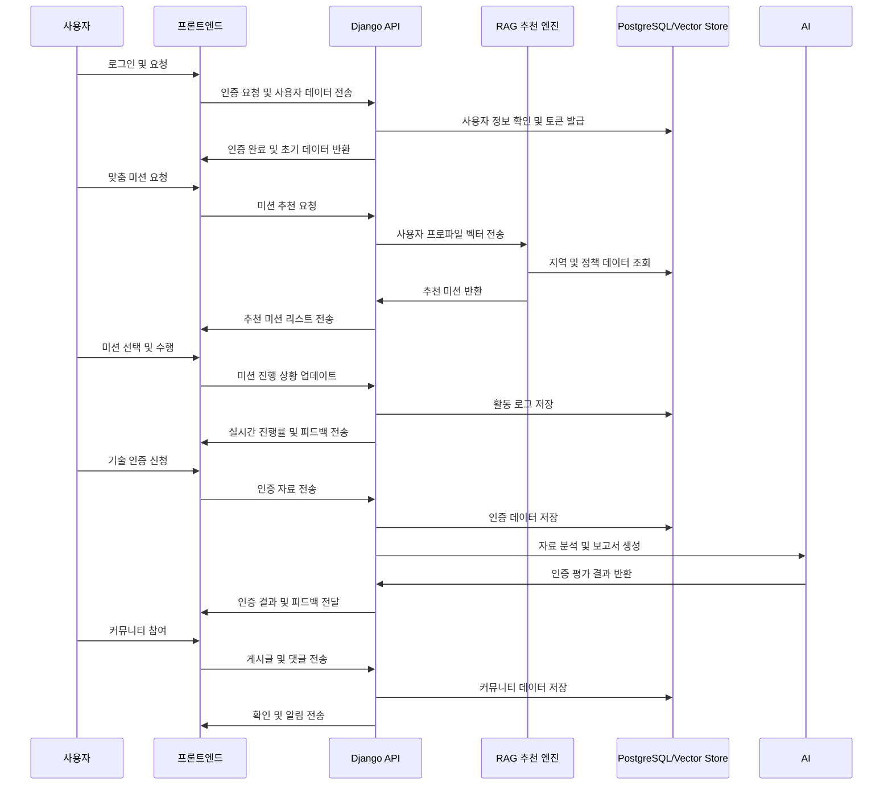

# 고향으로 ON - Django 기반 심화 설계 문서

## 전체 아키텍처 개요
- **백엔드 프레임워크**: Django (Python)
- **프론트엔드**: React (웹), Flutter (모바일)
- **추천 엔진**: LangChain + OpenAI API + RAG
- **DB**: PostgreSQL (관계형), Chroma/FAISS (Vector Store)
- **스토리지**: AWS S3
- **실시간 처리**: Django Channels, Redis

## 사용자 관리 및 인증 모듈
- **모듈 설계**: 사용자 유형 기반 Class 기반 View, Custom User Model 확장
- **보안**: JWT 토큰, OAuth2, Refresh 토큰 관리, django-cors-headers
- **확장성**: 소셜 로그인, 다중 인증 지원, 사용자 행동 로그 기록 연동

## 미션 추천 및 관리 모듈
- **엔진 구조**: LangChain 기반 RAG 엔진 → 사용자 프로파일 Vector → 맞춤형 미션 생성
- **백그라운드 작업**: Celery + Redis로 추천 결과 비동기 생성 및 저장
- **기능 상세**: 추천 점수 로직, 단계별 시나리오 설계, 실패/성공률 데이터 수집 및 분석

## 활동 로그 및 배지 시스템
- **저장 방식**: PostgreSQL + Redis 캐싱 → 실시간 순위/통계 제공
- **분석**: Pandas, Matplotlib, Apache Superset 연동 대시보드
- **알림**: 미션 완료 시 실시간 알림 (Django Channels), 배지 자동 발급 로직

## 기술 인증 및 지역 기여 매칭 모듈
- **분석 도구**: OpenCV + AI 모델 (이미지/음성 판독)
- **자동화 로직**: Celery 스케줄링, 관리자 승인 흐름과 자동 추천 매칭 엔진
- **신뢰성**: 인증 등급 단계화, AI 보고서 자동 생성 및 관리자 피드백 추가

## 커뮤니티 및 게시판 모듈
- **실시간 커뮤니케이션**: Django Channels + WebSocket
- **구성**: 게시판 CRUD, 멘토-멘티 매칭 게시판, 신고 처리 모듈, 관리 패널 통합

## REST API 및 외부 연동
- **API 설계**: DRF + drf-yasg, Swagger 문서 자동 생성
- **엔드포인트 보안**: OAuth2 + JWT, Role-based Access Control (RBAC)
- **외부 연동**: 지도 API (지역 탐방 미션), QR 인증 API, 외부 학습 플랫폼 연동 가능

## 데이터 분석 및 리포팅
- **데이터 파이프라인**: Celery 스케줄 → Pandas/NumPy 분석 → PostgreSQL 저장 → Superset 대시보드 시각화
- **리포트**: 사용자 개인 리포트, 지역별 사회 기여 효과 리포트, 지자체 정책 제안용 PDF 자동 생성

## 보안 및 운영 모니터링
- **보안**: CSRF/XSS 방어, 데이터 암호화, S3 버킷 권한 관리
- **모니터링**: AWS CloudWatch, Sentry 연동, Slack/메일 경고 시스템
- **로그 감사**: 사용자 행동 및 관리자 액션 로그, 정기적 백업

# 고향으로 ON - Django 기반 심화 설계 문서 (모듈 간 시퀀스 다이어그램 추가)

## 전체 아키텍처 개요

* **백엔드 프레임워크**: Django (Python)
* **프론트엔드**: React (웹), Flutter (모바일)
* **추천 엔진**: LangChain + OpenAI API + RAG
* **DB**: PostgreSQL (관계형), Chroma/FAISS (Vector Store)
* **스토리지**: AWS S3
* **실시간 처리**: Django Channels, Redis

## 모듈 간 시퀀스 다이어그램

